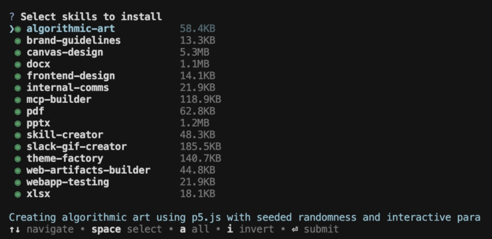
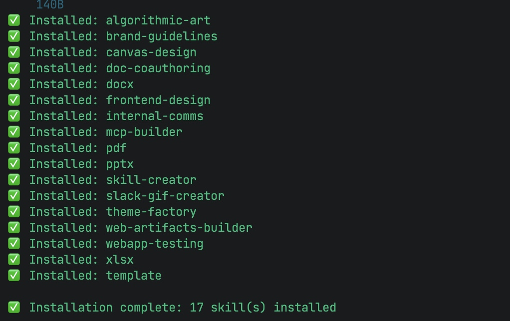

# 如何在Trae中使用Agent Skills

根据最新资料，Trae支持通过OpenSkills框架集成Claude Skills，实现功能扩展。以下是完整的使用指南：

## 一、环境准备

首先需要安装OpenSkills命令行工具，这是管理Skills的核心组件：

```bash
npm i -g openskills
```

## 二、安装Skills（三种方式）

### 方式1：从Anthropic官方市场安装

```bash
# 项目级安装（推荐，存储到项目根目录的 ./.claude/skills）
openskills install anthropics/skills

# 全局安装（存储到用户目录的 ~/.claude/skills）
openskills install anthropics/skills --global
```




### 方式2：从GitHub仓库安装
适用于第三方或自定义Skill：

```bash
openskills install your-org/custom-skills
```

### 方式3：从本地路径安装
用于开发中的私有Skill：

```bash
openskills install /path/to/my-skill
```

**常用参数说明**：
- `--global`：安装到全局目录（`~/.claude/skills`）
- `--universal`：安装到通用目录（`.agent/skills/`，优先级更高）
- `-y`：自动覆盖已存在的Skill

## 三、同步Skills到Trae

这是关键步骤！安装后必须执行同步，让Trae识别这些Skills：

新建AGENTS.md

```bash
# 同步到Trae默认规则文件 AGENTS.md
openskills sync

# 或同步到自定义路径（如果不存在会自动创建）
openskills sync --output .ruler/AGENTS.md
```

同步后，OpenSkills会：
1. 扫描已安装的Skills
2. 生成格式化的规则文档
3. 将Skill定义写入`AGENTS.md`

## 四、在Trae中配置规则文件

Trae通过规则文件加载Skills，具体操作：

1. **打开Trae的规则配置**：在Trae中找到"规则"或"Rules"设置
2. **创建AGENTS.md文件**：在规则目录中新建`AGENTS.md`文件（如果同步时未指定自定义路径）
3. **确认文件内容**：同步成功后，`AGENTS.md`会包含如下结构：

```markdown
## Available Skills

When users ask you to perform tasks, check if any of the available skills below can help complete the task more effectively.

How to use skills:
- Invoke: Bash("openskills read <skill-name>")
- The skill content will load with detailed instructions
- Base directory provided in output for resolving bundled resources

pdf
Comprehensive PDF manipulation toolkit for extracting text and tables, creating new PDFs, merging/splitting documents, and handling forms...

xlsx
Comprehensive spreadsheet creation, editing, and analysis with support for formulas, formatting, data analysis...
```

## 五、使用Skills

配置完成后，在Trae的Agent对话中直接输入自然语言指令即可：

**示例1：使用PDF Skill**
```
"把当前项目的README.md转换为PDF并放到项目中"
```

**示例2：使用Excel Skill**
```
"分析项目中的data.csv文件并生成带图表的Excel报告"
```

Trae会自动：
1. 扫描`AGENTS.md`中可用的Skills
2. 匹配用户指令与Skill描述
3. 执行`openskills read <skill-name>`加载Skill
4. 根据Skill的详细指令完成任务

## 六、进阶：开发自定义Skill

如果现有Skill不满足需求，可以开发专属Skill：

1. **创建Skill目录结构**：
```
my-skill/
├── skill.md          # Skill定义文件
├── references/       # 参考文档
├── scripts/          # 执行脚本
└── assets/           # 资源文件
```

2. **编写skill.md**：
```yaml
---
name: my-custom-tool
description: 描述你的工具功能
version: 1.0.0
---

# 详细的Prompt指令和用法说明
```

3. **本地安装并测试**：
```bash
openskills install /path/to/my-skill
openskills sync
```

## 七、常用管理命令

```bash
# 查看已安装的Skills
openskills list

# 读取某个Skill的详细内容
openskills read pdf

# 交互式移除Skill
openskills manage

# 移除特定Skill
openskills remove <skill-name>
```

## 注意事项

1. **路径优先级**：OpenSkills采用分层加载策略，优先级从高到低为：
   - `./.agent/skills/`（项目级-通用）
   - `~/.agent/skills/`（全局-通用）
   - `./.claude/skills/`（项目级-Claude）
   - `~/.claude/skills/`（全局-Claude）

2. **同步失败排查**：如果Trae无法识别Skill，请检查：
   - 是否正确执行了`openskills sync`
   - `AGENTS.md`是否在Trae的规则加载路径中
   - Skill是否安装在正确的目录

3. **资源引用**：Skill中引用的外部资源（如脚本、参考文档）需使用相对路径，并确保在Skill目录结构中。

通过以上步骤，你可以在Trae中灵活使用强大的Agent Skills，显著提升AI助手处理复杂任务的能力。

## 实例
週用fronten-designskils用HTML創建一↑現代化
的个人博客网站原型，包含首页、文章洋情页、关于
页面的完整博客